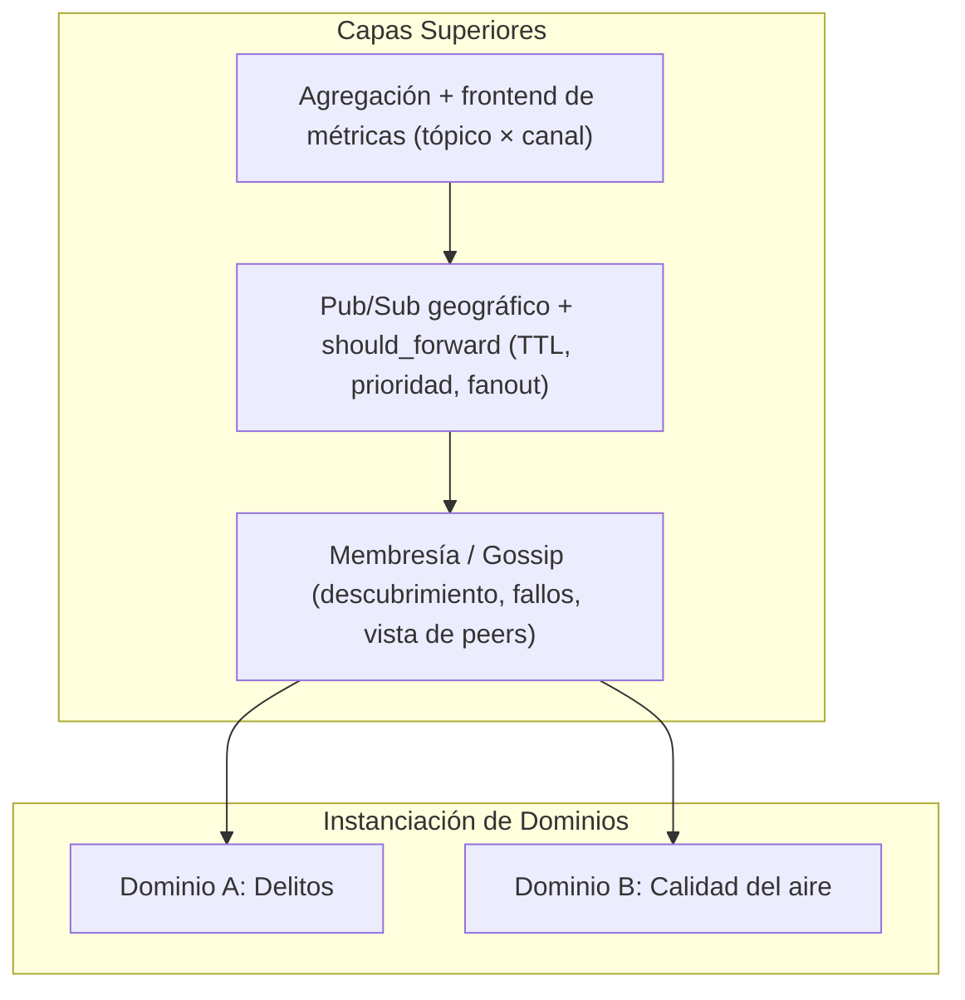
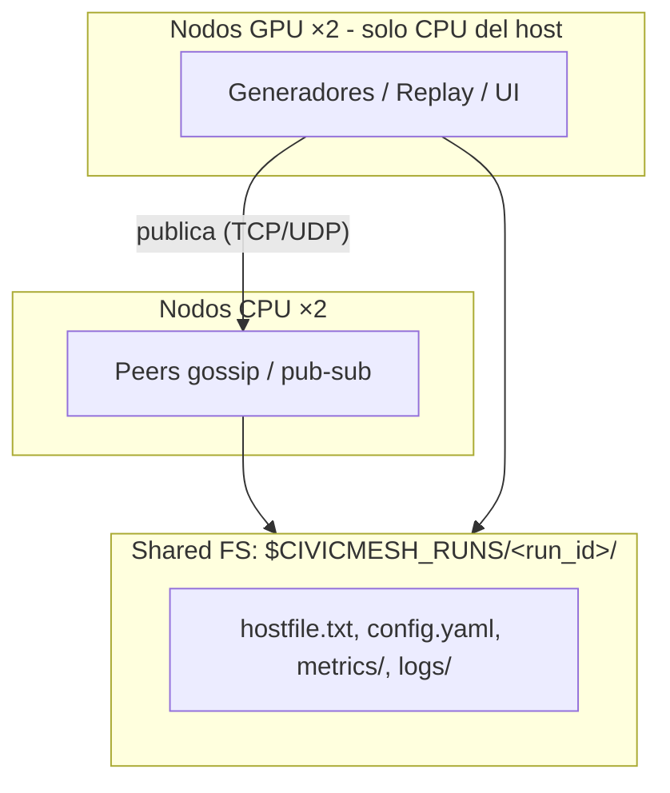

# Laboratorio 3: CivicMesh
## Un Framework P2P de Publish/Subscribe para Monitoreo Ciudadano Distribuido

**Departamento de Ingeniería Informática**  
**Universidad de Santiago de Chile**  
**Prof. Miguel Cárcamo**  
**Semestre 1-2026**  

---

## Resumen

En este laboratorio los equipos deben implementar **CivicMesh: una aplicación de monitoreo ciudadano distribuido** basada en una capa de comunicación reutilizable (gossip + pub/sub por tópico geográfico: comuna o región).

Esa capa debe instanciarse sobre **dos dominios distintos**, ambos centrados en la tensión entre **dato objetivo** (*ground truth*) y **dato subjetivo** (percepción):
- **Delitos:** delitos simulados por comuna frente al índice de sensación de inseguridad.
- **Calidad del aire:** canal objetivo con series reales (SINCA / Open-Meteo; ver [Apéndice A](#a-datos-reales-de-calidad-del-aire-canal-objetivo-del-dominio-b)) reproducidas por publicadores e inyectadas en la malla, frente a la percepción ciudadana.

Ambos canales (objetivo y subjetivo) deben propagarse sobre la *misma infraestructura*, pero con políticas distintas de fanout, TTL (*Time To Live*) y prioridad. El desafío es diseñar un framework generalizable y comparar cómo se comporta según la naturaleza del dato (eventos discretos vs. señal continua).

---

## 1. Objetivos de aprendizaje

Al finalizar el laboratorio, el equipo debe ser capaz de:
- Diseñar e implementar un protocolo de membresía **gossip** (descubrimiento, fallos, vista parcial).
- Implementar **pub/sub por tópico geográfico** con reenvío explícito (`should_forward`), no flooding ciego.
- Separar canales objetivo y subjetivo con **TTL/prioridad configurables**.
- Implementar los generadores estocásticos del Dominio A y de la percepción en ambos dominios (fórmulas de la [Sección 4.3](#43-modelos-de-generación-obligatorios)).
- Instanciar el mismo framework en dos dominios y **comparar su comportamiento estadístico** (incl. un frontend mínimo de métricas).
- Desplegar CivicMesh en el **clúster DIINF con Slurm** (2 nodos CPU + 2 nodos GPU, solo CPU del host) coordinado por shared FS ([Sección 5](#5-despliegue-en-el-clúster-diinf-slurm)).
- Evaluar **robustez ante caída de peers** o partición de red simulada.
- Operar el repositorio con issues, CI/CD verde (tests unitarios; integración en CI si es viable), Docker Compose, y los tres agentes de IA del Laboratorio 2.
- Documentar decisiones de diseño y contribución individual por rol.

### Terminología (usar en código, README e informe)
- **Peer:** proceso de la malla con gossip + pub/sub (en DIINF: hosts CPU).
- **Publicador:** proceso que genera o hace replay y publica al bus (delitos, aire, percepción). Puede ser un peer completo o un cliente solo-publish; en DIINF suele correr en hosts GPU (usando solo la CPU de ese host).
- **Host Slurm:** máquina del clúster; no confundir con peer.

### Acrónimos frecuentes
- **TTL:** *Time To Live* (vida útil del mensaje en hops o tiempo).
- **EMA:** *Exponential Moving Average* (media móvil exponencial).
- **RNG:** *Random Number Generator*.
- **CI/CD:** *Continuous Integration / Continuous Delivery*.
- **MR/PR:** *merge request / pull request*.
- **DIINF:** *Departamento de Ingeniería Informática, USACH*.
- **OMS:** *Organización Mundial de la Salud*.
- **SINCA:** *Sistema de Información Nacional de Calidad del Aire, MMA*.
- **IDW:** *Inverse Distance Weighting* (ya detallado en Dominio B).
- **PM2.5 / PM10:** material particulado $\le 2{,}5\,\mu\text{m}$ / $\le 10\,\mu\text{m}$.
> *En texto en español, los decimales usan coma (p. ej. 0,9), no punto.*

---

## 2. Introducción y motivación pedagógica

En sistemas distribuidos reales, el valor suele estar en la *infraestructura de comunicación* (quién se entera de qué, con qué latencia y bajo qué fallos), no solo en la interfaz de una app. CivicMesh pide exactamente eso: primero una API de framework (unirse a la malla, suscribirse a comunas, publicar en canal objetivo/subjetivo, consultar estado agregado local); después, dos *plugins* de dominio que usan esa API.

Los delitos se modelan como **eventos discretos y localizados** (simulados); la calidad del aire como una **señal continua real** (series de PM2.5/PM10) que procesos publicadores reproducen y inyectan en la malla. En el despliegue del clúster, esos publicadores suelen vivir en los nodos GPU (solo CPU del host), mientras los peers de gossip/pub-sub corren en los hosts CPU ([Sección 5](#5-despliegue-en-el-clúster-diinf-slurm)). El informe debe explicar *por qué* el mismo protocolo produce brechas percepción–realidad distintas, no solo mostrar gráficos.

---

## 3. Arquitectura del framework (obligatoria)

La implementación interna es decisión de diseño del equipo (parte de la evaluación), pero deben existir las siguientes capas. La Figura 1 resume la visión.


*Figura 1: CivicMesh: framework común instanciado en dos dominios (Misma infraestructura · dos instancias · doble canal objetivo/subjetivo).*

### 3.1. Capa de membresía y descubrimiento (Gossip)

Cada peer mantiene una vista parcial de la malla (peers conocidos), intercambia mensajes periódicos de membresía y detecta caídas por timeout. El **fanout de gossip** es el número de peers a los que un peer reenvía (o con los que intercambia) información de membresía en cada ronda. Elegir mal el fanout afecta latencia de descubrimiento, tráfico de red y robustez.

El equipo debe implementar una política y justificarla. Ejemplos (no exhaustivos):
- **Aleatorio:** En cada ronda se eligen $f$ peers uniformes al azar de la vista local. Simple y suele mezclar bien la información; no aprovecha geografía ni tópicos.
- **Sesgado por proximidad de tópico:** Se favorece peers suscritos a comunas iguales o vecinas (misma región / arista en el grafo de adyacencia comunal). Útil si la carga de pub/sub es local: la membresía "sigue" el interés geográfico, a costa de peor mezcla global.
- **Híbrido:** Parte del fanout aleatorio (exploración) y parte sesgado (explotación geográfica). Compromiso típico entre cobertura de la malla y eficiencia local.

> [!NOTE]
> El fanout de gossip (membresía) es distinto del fanout de pub/sub (cuántos peers reciben un evento de un tópico). Ambos deben documentarse por separado.

### 3.2. Capa de Publish/Subscribe por tópico geográfico

- **Tópico:** Comuna o región de Chile (el conjunto mínimo de comunas lo define el equipo; se sugiere un subconjunto del Gran Santiago o una región acotada para experimentos reproducibles).
- **Suscripción:** A una comuna y, opcionalmente, a comunas vecinas (útil para discutir propagación espacial, sobre todo en aire).
- Debe existir una función explícita de reenvío, análoga a:
  ```python
  should_forward(msg, topic, local_view) -> bool
  ```
  No se acepta como solución un flooding trivial sin criterio (TTL/prioridad/interés/hop-count).

### 3.3. Doble canal de mensajes por tópico

Para cada tópico geográfico:
- **Canal objetivo:** Ground truth del dominio (simulado en A; series reales en B).
- **Canal subjetivo:** Dato percibido, con sesgo intencional y amplificación por repetición/gossip (rumores, memoria de picos, desconfianza).
- Cada canal debe poder configurarse con **TTL** (*Time To Live*: máximo de hops o tiempo de vida del mensaje) y **prioridad de reenvío** distintos.

### 3.4. Capa de agregación y frontend

- Cada peer mantiene un **estado agregado local** por tópico suscrito y por canal.
- Además, el equipo debe exponer un **frontend mínimo de estadísticas** ([Sección 5.4](#54-frontend-de-estadísticas)) que consuma métricas desde el shared FS (o una API agregadora). La misma convención de directorios aplica en corridas locales. Un frontend sofisticado no compensa flooding ni ausencia de protocolo.

---

## 4. Dominios de aplicación

> [!IMPORTANT]
> **Regla no negociable:** el grupo implementa el framework una sola vez (un código base) y lo ejecuta sobre ambos dominios. No se elige uno. Pueden ser dos corridas (o dos perfiles Compose / dos jobs Slurm) sobre el mismo binario/código; no hace falta mezclar delitos y aire en el mismo proceso si complica el diseño, pero sí hace falta demostrar ambos.

### 4.1. Dominio A — Delitos: percepción vs. realidad

- **Canal objetivo:** Delitos simulados por comuna según las fórmulas de la [Sección 4.3](#43-modelos-de-generación-obligatorios). Las tasas $\lambda_{c,k}$ pueden inspirarse en órdenes de magnitud de datos públicos (INE / Fiscalía) usados solo como semilla; no se exige ingesta de datasets reales ni reproducir cifras oficiales.
- **Canal subjetivo:** Índice de sensación de inseguridad simulado por un publicador ([Sección 4.3](#43-modelos-de-generación-obligatorios)): combina el ground truth local, una memoria EMA y rumores recibidos por gossip.

### 4.2. Dominio B — Calidad del aire: medición vs. percepción

- **Canal objetivo:** Series reales de PM2.5 / PM10 (SINCA y/o Open-Meteo; [Apéndice A](#a-datos-reales-de-calidad-del-aire-canal-objetivo-del-dominio-b)). Cada publicador asociado a una comuna (o estación) reproduce la serie en el tiempo de simulación de la malla y publica muestras en el tópico geográfico correspondiente. El valor publicado es el dato de la fuente (más un timestamp y metadatos), no una muestra de un generador estocástico. Contextualizar severidad con umbrales OMS (Organización Mundial de la Salud) 2021.
- **Reproducibilidad vs. API en vivo:** Se recomienda descargar y cachear las series en el repositorio (JSON/CSV) y hacer replay offline. Así el experimento es reproducible y no depende de la red el día de la defensa. Consumir la API en runtime es opcional y no sustituye tener un dataset fijado para los gráficos del informe.
- **Comunas sin estación / extrapolación espacial:** Si solo hay pocas estaciones (típico con SINCA) o faltan series para algunas comunas del experimento, hay que extender la cobertura hacia comunas aledañas. Sea $v_c(t)$ el valor (p. ej. PM2.5) de la comuna $c$ en el instante $t$, y $S$ el conjunto de estaciones/comunas con serie real. Opciones aceptables (elegir y justificar):
  - **Herencia por vecino más cercano:**
    $$v_c(t) = v_{s^\star}(t), \quad s^\star = \arg\min_{s \in S} d(c, s),$$
    donde $d(c, s)$ es distancia geográfica (o hops en el grafo comunal).
  - **Promedio de vecinos:** si $N(c)$ son las comunas/estaciones adyacentes a $c$ con dato en $t$,
    $$v_c(t) = \frac{1}{|N(c)|} \sum_{s \in N(c)} v_s(t).$$
  - **IDW (Inverse Distance Weighting):** interpolación espacial por instante
    $$v_c(t) = \frac{\sum_{s \in S} w_s v_s(t)}{\sum_{s \in S} w_s}, \quad w_s = \frac{1}{d(c, s)^p},$$
    con potencia $p \ge 1$ (típico $p = 2$). Si $d(c, s) = 0$, tomar $v_c(t) = v_s(t)$.

  En el informe debe quedar explícito qué comunas tienen serie propia (estación o coordenada Open-Meteo directa) y cuáles son heredadas/extrapoladas, con el método y los parámetros usados ($p$, definición de $d$, vecinos). Eso sigue siendo pipeline de datos reales, no un simulador calibrado.
- **Canal subjetivo:** Percepción ciudadana simulada por un publicador a partir de $v_c(t)$ ([Sección 4.3](#43-modelos-de-generación-obligatorios)): memoria de picos, sesgo y amplificación por rumores.

### 4.3. Modelos de generación (obligatorios)

Estos modelos aplican al Dominio A (ambos canales) y al canal subjetivo del Dominio B. El canal objetivo del Dominio B no se genera estocásticamente: es replay (o extrapolación espacial) de series reales ([Apéndice A](#a-datos-reales-de-calidad-del-aire-canal-objetivo-del-dominio-b)).

**Quién genera qué:** En cada intervalo $\Delta t$, un publicador asociado a la comuna $c$:
1. Obtiene o genera el valor objetivo de $c$ (Poisson en A; muestra de replay en B).
2. Publica ese valor en el canal objetivo del tópico $c$.
3. Actualiza su estado interno de percepción $M_c$ y calcula $P_c(t)$ con las fórmulas de abajo (usando el objetivo local y, si hay, rumores subjetivos ya recibidos en el tópico).
4. Publica $P_c(t)$ en el canal subjetivo del mismo tópico $c$.

Los peers suscritos a $c$ reciben ambos canales vía pub/sub; al reenviar rumores subjetivos amplifican $\hat{P}^{\text{gossip}}$ en otros publicadores/peers.

Los generadores deben ser reproducibles (`--seed` o equivalente en `config.yaml`). Los parámetros viven en un archivo versionado; el informe lista los valores de los gráficos finales. Condiciones iniciales: $M_c(0) = 0$, $\hat{P}_c^{\text{gossip}}(0) = 0$.

---

#### Dominio A — canal objetivo (delitos)

Por comuna $c$, tipo de delito $k$ e intervalo $\Delta t$:
$$X_{c,k}(t) \sim \text{Poisson}(\lambda_{c,k} \Delta t).$$

Se publica un evento discreto (`comuna`, `tipo`, `count`, `t`) en el canal objetivo. Las tasas $\lambda_{c,k}$ se fijan en YAML/JSON del repositorio. El RNG (*Random Number Generator*) debe documentarse (p. ej. semilla compuesta `seed + hash(c, k)`).

---

#### Canal subjetivo — definición común

Sea $G_c(t)$ el ground truth local del paso (en A: $R_c(t) = \sum_k X_{c,k}(t)$; en B: $v_c(t)$ de la serie real o extrapolada).

Sea $\hat{P}_c^{\text{gossip}}(t)$ un resumen de los mensajes del canal subjetivo recibidos en el tópico $c$ desde el paso anterior (elegir y fijar uno):
$$\hat{P}_c^{\text{gossip}}(t) = \begin{cases} \frac{1}{|Q|} \sum_{p \in Q} p & \text{si } Q \neq \emptyset \text{ (promedio de rumores),} \\ 0 & \text{si } Q = \emptyset, \end{cases}$$
donde $Q$ es el multiconjunto de valores subjetivos recibidos (alternativa aceptable: máximo de $Q$). Eso modela la amplificación por repetición: más rumores (o rumores altos) empujan $P_c$.

Sea $M_c(t)$ una memoria EMA (*Exponential Moving Average*) del estímulo local, con factor $\alpha \in (0, 1)$ (típico $\alpha \in [0{,}7; 0{,}9]$; valores altos = olvido más lento):
$$M_c(t) = \alpha M_c(t - \Delta t) + (1 - \alpha) u_c(t),$$
donde el estímulo $u_c(t)$ depende del dominio.

---

#### Dominio A — canal subjetivo (inseguridad)

Estímulo $u_c(t) = R_c(t)$. Índice $P_c(t) \in [0, 1]$ publicado en el canal subjetivo:
$$M_c(t) = \alpha M_c(t - \Delta t) + (1 - \alpha) R_c(t) \tag{1}$$
$$Z_c(t) = \beta_0 + \beta_1 M_c(t) + \beta_2 \hat{P}_c^{\text{gossip}}(t) + \varepsilon_c(t) \tag{2}$$
$$P_c(t) = \sigma(Z_c(t)) \tag{3}$$

con $\varepsilon_c(t) \sim \mathcal{N}(0, \sigma_\varepsilon^2)$ (mismo seed documentado) y $\sigma(z) = (1 + e^{-z})^{-1}$ la logística (si se prefiere, clip lineal a $[0, 1]$ en lugar de $\sigma$).

**Valores sugeridos de partida (ajustables si se documentan):**
- $\beta_0 = -1{,}0$
- $\beta_1 = 0{,}4$
- $\beta_2 = 0{,}8$
- $\sigma_\varepsilon = 0{,}1$
- $\alpha = 0{,}8$

*Interpretación:* $\beta_1$ peso de la memoria local; $\beta_2$ peso del rumor gossip (si $\beta_2 > \beta_1$, los rumores dominan la percepción).

---

#### Dominio B — canal subjetivo (aire)

Estímulo con memoria de pico (no baja tan rápido como $v_c$):
$$u_c(t) = \max(v_c(t), M_c(t - \Delta t)).$$

Percepción publicada (misma unidad que $v_c$, p. ej. $\mu\text{g}/\text{m}^3$):
$$M_c(t) = \alpha M_c(t - \Delta t) + (1 - \alpha) u_c(t) \tag{4}$$
$$P_c(t) = v_c(t) + \gamma (M_c(t) - v_c(t)) + \delta \hat{P}_c^{\text{gossip}}(t) + \varepsilon_c(t) \tag{5}$$

Luego aplicar clip a un rango físico razonable (p. ej. $[0; 500]$).

**Valores sugeridos:**
- $\alpha = 0{,}85$
- $\gamma = 0{,}6$ (sesgo por pico retenido)
- $\delta = 0{,}3$ (arrastre por rumor)
- $\sigma_\varepsilon = 2{,}0$

Los umbrales OMS contextualizan $v_c$ y $P_c$ en el informe; no inventan $v_c$.

---

### Qué debe quedar claro en el informe
Tabla con: dominio, fórmulas usadas, parámetros numéricos, definición exacta de $Q / \hat{P}^{\text{gossip}}$, seed, y un ejemplo numérico de un paso $t$ (entradas $\to M_c, P_c$).

### 4.4. Qué debe comparar el informe
Cómo el mismo protocolo se comporta distinto según la naturaleza del dato: delitos (eventos discretos, localizados) vs. aire (serie continua, con interés espacial entre comunas vecinas). En particular:
- Convergencia del canal objetivo.
- Brecha percepción–realidad del canal subjetivo.
- Sensibilidad a fanout / TTL / prioridad.

---

## 5. Despliegue en el clúster DIINF (Slurm)

Además de pruebas locales y Docker Compose, el equipo debe demostrar una corrida en el clúster del DIINF con Slurm (scripts + evidencia en el informe). Recursos de referencia: **2 hosts CPU** y **2 hosts GPU**.

> [!IMPORTANT]
> Aunque se reserven hosts GPU, CivicMesh **no usa CUDA** en este laboratorio. En esos hosts se emplean solo las CPU del nodo (sin kernels, sin nvcc, sin GPGPU). Usar CUDA no suma puntaje.

### 5.1. Mapeo de procesos

| Recurso Slurm | Qué corre | Notas |
| :--- | :--- | :--- |
| **2 hosts CPU** | Peers: gossip + pub/sub + `should_forward` + estado local | Varios procesos peer por host (p. ej. 1 peer $\approx$ 1–N comunas). |
| **2 hosts GPU** | Publicadores (gen. A, replay B, percepción) + frontend | Solo CPU del host; publican por red hacia peers en CPU. |
| **Shared FS** | `hostfile`, `config`, `dataset`, `metrics/`, `logs` | Coordinación y métricas para el frontend (no sustituye el gossip en red). |


*Figura 2: Roles partidos en el clúster: malla (peers) en nodos CPU; generadores, replay y frontend en nodos GPU usando solo la CPU del host; artefactos en shared FS.*

### 5.2. Shared FS: cómo se conecta todo

Slurm asigna hosts y lanza procesos; el filesystem compartido del DIINF (home/proyecto montado en todos los nodos) es el bus de configuración y de métricas. El tráfico de gossip/pub-sub sigue siendo red entre peers.

Convención de directorio (documentar el path real en el `README.md`). En Slurm usar `$SLURM_JOB_ID`; en local/Compose usar un id de corrida propio (p. ej. `local-${USER}-${TS}`):
```text
$CIVICMESH_RUNS/<run_id>/
├── hostfile.txt     # host:port por peer
├── config.yaml      # seed, comunas, TTL, fanout, lambdas
├── metrics/         # JSONL (o similar) por peer o agregado
└── logs/            # stdout/stderr
```

### 5.3. Secuencia de arranque (bootstrap)

1. `sbatch` reserva 2 hosts CPU + 2 hosts GPU (constraints/particiones del DIINF; confirmar nombres con `sinfo`; el enunciado no fija el nombre de partición).
2. Una tarea inicial crea el directorio de la corrida, escribe `config.yaml` y deja accesible el dataset de aire cacheado.
3. En hosts CPU (`srun`): cada peer elige `host:port` y registra la entrada en `hostfile.txt` (append atómico, o un peer-0 escribe la lista tras descubrir hermanos).
4. Peers leen el `hostfile`, hacen JOIN gossip (1–2 seeds); publicadores en hosts GPU leen la misma config/endpoints y publican por red hacia la malla.
5. Cada peer vuelca periódicamente métricas a `metrics/` (convergencia, brecha percepción–realidad, hops, drops, ...).
6. El frontend lee `metrics/` (mismo job o job aparte en un host GPU, solo CPU) y sirve la UI (puerto + tunnel SSH si aplica; documentar en el README).
7. Experimento de fallo/partición: matar peers de un host CPU (`scancel` de un step o `kill`); evidenciar el efecto en métricas y en el frontend.

### 5.4. Frontend de estadísticas

El frontend es **obligatorio** tanto en corridas locales/Compose como en el clúster (mismo contrato de métricas bajo `$CIVICMESH_RUNS/<run_id>/metrics/`; en DIINF suele levantarse en un host GPU usando solo la CPU del host).

- **Alcance acotado:** Stack libre y ligero (Streamlit, Flask+charts, FastAPI+HTMX, etc.).
- **Debe mostrar al menos:**
  1. Estado por tópico $\times$ canal.
  2. Brecha percepción–realidad.
  3. Convergencia entre peers (valores del canal objetivo alineados o divergencia acotada bajo la política documentada).
- **Dueño:** rol de Analítica ([Sección 6](#6-roles-del-equipo-grupos-de-5)). El rol CI/CD documenta el lanzamiento (Compose, local, sbatch, puerto, tunnel SSH si aplica).

---

## 6. Roles del equipo (grupos de 5)

Cada integrante tiene un rol principal evaluable; el diseño arquitectónico es decisión conjunta. Un mismo estudiante puede apoyar otras capas, pero el informe debe dejar claro quién lideró qué. En el `README.md` incluyan una tabla nombre / rol / responsabilidades.

1. **Líder de Capa de Red / Gossip:** membresía, descubrimiento, tolerancia a fallos.
2. **Líder de Capa Pub/Sub:** tópicos, suscripciones, `should_forward`, fanout.
3. **Líder de Datos:** ingesta/cache Dominio B (SINCA/Open-Meteo $\to$ replay); generadores Poisson y percepción ([Sección 4.3](#43-modelos-de-generación-obligatorios)); configuración de tasas/sesgos.
4. **Líder de Analítica y Estadística:** métricas de convergencia/divergencia; experimentos de caída/partición; frontend de estadísticas ([Sección 5.4](#54-frontend-de-estadísticas)).
5. **Líder de CI/CD, Git y agentes:** pipeline CI verde con tests; Dockerfile y docker-compose; ramas/issues/MR; los tres agentes del Lab 2; scripts sbatch/shared FS; README (local, Compose, clúster y cómo abrir la UI).

El informe final debe incluir una sección breve de contribución individual por rol.

---

## 7. Git, CI/CD y agentes (igual que el Lab 2)

El repositorio se evalúa como proyecto de software, con los mismos criterios de flujo e ingeniería del Laboratorio 2 (adaptados a Python / CivicMesh).

### 7.1. Repositorio, issues y CI

- **Repositorio Git** (GitHub o GitLab) con historial; rama `main` protegida (merge solo vía MR/PR).
- Trabajo en ramas `feature/*` o `fix/*`; cada MR/PR referencia al menos un issue.
- **Mínimo:** 5 issues creados por el equipo (al menos 1 por rol distinto), 3 MR/PR fusionados a `main`, cada uno vinculado a un issue.
- **CI/CD funcionando en cada MR:** la suite de tests unitarios debe pasar; los tests de integración también, si el runner lo permite ([Sección 7.2](#72-tests-y-docker-compose)). Pipeline verde en la entrega.
- `README.md` con instalación (Compose y local), cómo levantar $N$ nodos / servicios, Slurm, convención `$CIVICMESH_RUNS`, seeds, dataset de aire, frontend, roles y agentes.
- `CHANGELOG.md` (Keep a Changelog) y tag de release al entregar (p. ej. `v1.0.0-lab3`).

### 7.2. Tests y Docker Compose

- **Tests unitarios (obligatorios en el repo y en CI):** Cubrir al menos: `should_forward` / TTL / prioridad; membresía gossip (vista parcial, timeout de fallo); generadores A y percepción A/B con `--seed` fijo (misma semilla $\Rightarrow$ misma secuencia); parsing/replay de una muestra mínima del dataset de aire (fixture en el repo).
- **Tests de integración (obligatorios en el repo):** Al menos un escenario multi-proceso o multi-contenedor con 3 o más peers: un publicador envía a un tópico; un suscriptor recibe el mensaje; el estado agregado del suscriptor refleja el valor esperado bajo la política documentada. Incluir, si es razonable, un caso de caída de un peer.
- **CI:** En cada MR deben pasar los unitarios. Los de integración deben correr en CI si el runner lo permite (p. ej. docker compose en el job). Si no es viable (timeout/límites del runner), el README debe indicar el comando Compose/local exacto y el informe debe adjuntar un log de ejecución exitosa; eso no exime de tener los tests en el repo.
- **Herramienta sugerida:** `pytest`. Comando documentado (p. ej. `pytest -q` o `make test`).
- **Dockerfile + docker-compose.yml (o compose.yaml) obligatorios:** Con un comando documentado (p. ej. `docker compose up --build`) debe levantarse al menos: 3 peers + 1 publicador (Dominio A o B). El frontend puede ir en el mismo Compose o documentarse aparte. Usar red interna entre servicios; montar o copiar config/dataset necesarios.
- Los agentes de IA no sustituyen la suite: el job de tests de CI debe estar verde antes del comentario del revisor de MR.

### 7.3. Tres agentes de IA

Los mismos tres agentes del Lab 2, con scripts/prompts versionados (`scripts/agents/` o workflows de CI) y evidencia de uso real:
1. **Documentador:** README / CHANGELOG; issues de docs; auto-fix solo si es mecánico.
2. **Revisor de bugs:** código y tests (gossip, pub/sub, replay, seeds); issue o MR si el fix es mecánico; si toca protocolo o semántica $\to$ "requiere intervención humana".
3. **Revisor de MR:** comentario en cada MR después de CI; nunca merge automático a main.

En el informe: tabla agente / herramienta / frecuencia, y al menos dos ejemplos reales por agente (issue, comentario en MR, o caso escalado a humano).

---

## 8. Entregables

1. **Repositorio Git con:** código fuente (Python) del framework y de ambas instancias de dominio; generadores según [Sección 4.3](#43-modelos-de-generación-obligatorios); frontend; `tests/` (unitarios e integración); `Dockerfile` y `docker-compose`; scripts Slurm (`sbatch`/`srun`); `README`; issues y MR del período; CI/CD verde; configuración de los tres agentes; series de aire cacheadas (o script de regeneración); tag de release.
2. **Informe (PDF) con, como mínimo:**
   - Arquitectura implementada y decisiones (fanout, TTL, prioridad, vecindad geográfica).
   - Parámetros de los generadores y del canal subjetivo (tabla + ejemplo numérico de un paso; ver [Sección 4.3](#43-modelos-de-generación-obligatorios)), seed, y fuentes del Dominio B (SINCA y/o Open-Meteo), período, comunas/estaciones, replay y (si aplica) extrapolación espacial.
   - Mapa proceso $\leftrightarrow$ nodo Slurm y convención del shared FS usada.
   - Por dominio: gráficos de convergencia del canal objetivo y de divergencia percepción–realidad del canal subjetivo.
   - Comparación cuantitativa entre dominios; capturas o URL del frontend.
   - Cómo correr tests (`pytest`/`make test`) y Compose; enlace al pipeline CI verde.
   - Robustez: experimento con caída de peers o partición con evidencia (preferible en DIINF; aceptable en Compose/local si además hay corrida multi-host documentada en el clúster).
   - Flujo Git / CI / agentes (evidencia breve) y contribución individual por rol.

---

## 9. Cronograma tentativo (3 semanas)

| Semana | Foco | Hitos sugeridos |
| :---: | :--- | :--- |
| **1** | Framework + Git/CI | Gossip + pub/sub + `should_forward`; tests unitarios; Compose con 3+ peers; CI verde; issues; agentes. |
| **2** | Dominios + Slurm | Dataset aire + generadores (Sec. 4.3); tests de integración; sbatch/shared FS. |
| **3** | Métricas y cierre | Frontend; convergencia/divergencia; fallos/partición en DIINF; informe; evidencia de agentes; release. |

---

## 10. Requisitos técnicos

- **Lenguaje:** Python. Se permite `asyncio`, `multiprocessing`, sockets u librerías ligeras de transporte. No se exige (ni se prioriza) un broker externo tipo Kafka/RabbitMQ: la lógica de gossip y pub/sub debe implementarse como parte del aprendizaje.
- Ejecución local, vía Docker Compose ([Sección 7.2](#72-tests-y-docker-compose)) y en el clúster DIINF (Slurm, [Sección 5](#5-despliegue-en-el-clúster-diinf-slurm)).
- En nodos GPU del DIINF: solo CPU del host; no se pide ni se evalúa CUDA.
- Suite de tests unitarios e integración según [Sección 7.2](#72-tests-y-docker-compose) (unitarios siempre en CI; integración en CI si el runner lo permite).
- Dockerfile y docker-compose que levanten $\ge 3$ peers + $\ge 1$ publicador.
- Al menos un experimento con partición de red o caída de peers, con evidencia (logs/métricas/frontend) en el informe.
- Seeds reproducibles y fórmulas de la [Sección 4.3](#43-modelos-de-generación-obligatorios) implementadas.
- Dominio B: script(s) de descarga (Open-Meteo y/o CSV SINCA), series cacheadas en el repo, y replay determinista ([Apéndice A](#a-datos-reales-de-calidad-del-aire-canal-objetivo-del-dominio-b)).
- Frontend mínimo ([Sección 5.4](#54-frontend-de-estadísticas)) alimentado desde shared FS o API agregadora.
- CI/CD y agentes operativos según la [Sección 7](#7-git-cicd-y-agentes-igual-que-el-lab-2).

---

## 11. Criterios de rechazo / no cumplimiento

El laboratorio se considerará **no aprobado** (o con nota máxima severamente acotada) si ocurre cualquiera de lo siguiente:
- Solo se implementa un dominio.
- No hay capa gossip/pub-sub propia (p. ej. "todo es un diccionario en un solo proceso" sin red entre nodos).
- El reenvío es flooding sin TTL/prioridad/interés documentado.
- No hay experimento de fallo/partición con evidencia.
- No hay scripts Slurm reproducibles ni evidencia de corrida multi-host en DIINF.
- No hay frontend consultable de estadísticas.
- No hay tests unitarios e integración en el repo, o el CI no ejecuta al menos los unitarios.
- No hay Dockerfile / docker-compose que levante la malla según el README.
- No hay repositorio Git con issues, CI/CD funcionando y los tres agentes con evidencia de uso.
- No hay sección de contribución individual por rol.

---

## 12. Entrega

- Repositorio Git (enlace) con código, README, tests, Docker Compose, issues, CI verde, agentes, scripts Slurm, frontend e informe PDF (o el PDF en el repo / aula virtual según anuncio).
- **Fecha y canal de entrega:** según anuncio del curso / aula virtual.
- **Defensa oral breve (si se solicita):** cada rol debe poder explicar su capa (incluido CI/CD, Slurm/shared FS, frontend y agentes).

> *CivicMesh — Laboratorio 3, SDP 1-2026. El objetivo no es "una demo bonita", sino un framework que se pueda razonar, medir y reutilizar.*

---

## A. Datos reales de calidad del aire (canal objetivo del Dominio B)

El canal objetivo del Dominio B no se simula: los publicadores de replay inyectan valores tomados de series reales en la malla. 

### Flujo esperado:
1. Descargar (una vez) series horarias de PM2.5 / PM10 para las comunas/estaciones del experimento.
2. Guardarlas en el repo (JSON/CSV) o regenerarlas con un script versionado.
3. En la corrida multi-nodo, cada publicador de replay avanza un reloj lógico/acelerado y publica el valor correspondiente a su tópico (`comuna`, `pm2_5`, `t`, ...). En el clúster DIINF estos procesos suelen ejecutarse en hosts GPU (solo CPU del host); los peers de gossip/pub-sub viven en hosts CPU ([Sección 5](#5-despliegue-en-el-clúster-diinf-slurm)).

El informe debe documentar: fuente, período, estaciones/coordenadas, mapeo comuna $\leftrightarrow$ serie, política ante huecos, y —si aplica— el método de extrapolación/interpolación hacia comunas sin estación (vecino más cercano, promedio, IDW, etc.).

### Opción 1: Open-Meteo (Air Quality API)
- No requiere API key ni registro.
- **Endpoint base:** `https://air-quality-api.open-meteo.com/v1/air-quality`
- **Parámetros mínimos:** `latitude`, `longitude`, `hourly` (p. ej. `pm2_5`, `pm10`); opcionalmente `start_date` / `end_date`.
- **Ventaja:** cobertura amplia en Chile con coordenadas aproximadas por comuna; ideal para armar el dataset de replay de todas las comunas del experimento.

**Ejemplo de request (Python):**
```python
import requests

params = {
    "latitude": -33.45,
    "longitude": -70.66,
    "hourly": "pm2_5,pm10",
    "start_date": "2025-06-01",
    "end_date": "2025-06-30",
}
r = requests.get(
    "https://air-quality-api.open-meteo.com/v1/air-quality",
    params=params,
    timeout=60,
)
data = r.json()
# data["hourly"]["time"], data["hourly"]["pm2_5"], ... -> cache JSON/CSV
# En el publicador de replay: publicar cada muestra en orden
```

### Opción 2: SINCA (MMA)
- **Portal:** `https://sinca.mma.gob.cl`
- No hay API pública estable: la descarga es por la interfaz web (región, estación, contaminante, período) y genera un CSV.
- Elegir 2–3+ estaciones (comunas distintas del Gran Santiago u otra región) y usar esos CSV como series oficiales de replay.
- **Ventaja:** mediciones oficiales ligadas al índice ICA / umbrales regulatorios en Chile.
- **Desventaja:** cobertura geográfica desigual; muchas comunas no tienen estación cercana. En ese caso extrapolar hacia comunas aledañas con alguno de los métodos del Dominio B (vecino más cercano, promedio de vecinos, IDW por instante) y documentarlo. Open-Meteo puede complementar la cobertura; SINCA sirve bien como ancla oficial.
